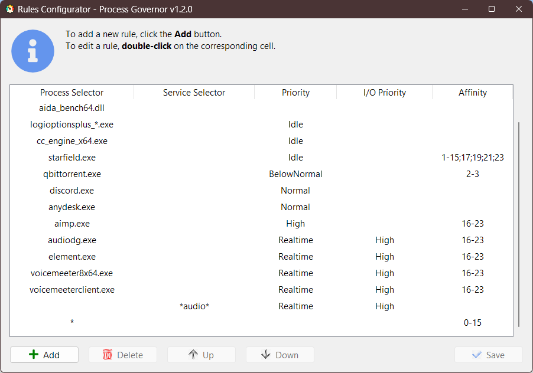

[ Русская версия](README.ru.md)

---

**Process Governor** is a Python utility designed to manage Windows processes and services by adjusting their
priorities, I/O priorities, and core affinity based on user-defined rules in a JSON configuration.

   
Screenshots

   >
   > 
   >
   > 
   >

## Features

- Adjust process and service priorities for better performance.
- Control I/O priorities to optimize resource utilization.
- Define core affinity for processes.
- Fine-tune Windows services and processes based on [user-defined rules](ui_rule_configurator.md).
- Continuous monitoring of the configuration file for rule application.
- Ability to add ProcessGovernor to autorun.

## Getting started

To get started with **Process Governor**, follow these steps:

1. Download the latest ready-to-use build from the following
   link: [Latest Release](https://github.com/SystemXFiles/process-governor/releases/latest).
2. Run the `Process Governor.exe` executable with **administrative privileges**.
   This is important to allow the program to make the necessary adjustments to process and service priorities, I/O
   priorities, and core affinity.
3. [Configure the rules](ui_rule_configurator.md) for processes and services.

You can close the program by accessing the tray icon.

## Knowledge base

* [Configuring rules](ui_rule_configurator.md)
* [Configuration file](configuration_file.md)
* [Running from source and creating a portable build](run_and_build.md)
* **Tips and Tricks**
  * [Optimizing Audio on PC](tips'n'tricks/audio.md)
  * [Starfield Optimization: Reduce Stutters](tips'n'tricks/starfield.md)
## License

This project is licensed under the GNU General Public License v3.0 - see the [LICENSE](../LICENSE) file for details.