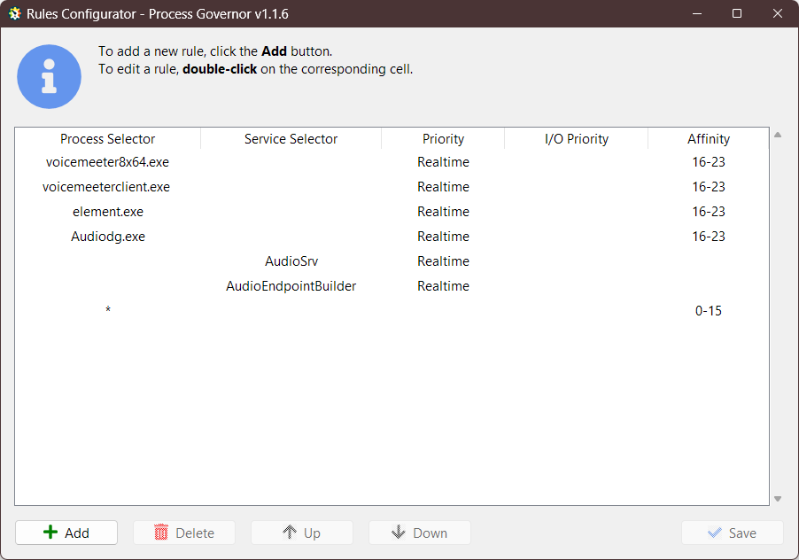

# Оптимизация звука с использованием Process Governor

[ README](../README.ru.md) | [ English version](audio.md)

---

> **Предисловие:**
>
> Если вы занимаетесь музыкой, стримингом или просто стремитесь к идеальному звуку в дискорде или на работе и при этом
> используете обработку звука в реальном времени, эта статья для вас. Она расскажет о методах оптимизации системы для
> предотвращения проблем со звуком, таких как заикания или треск при высокой нагрузке на процессор. Предложенный подход
> поможет вам настроить процессорные ресурсы таким образом, чтобы аудиопроцессы получали приоритет и не страдали от
> конкуренции с другими задачами.

## Введение

В данной статье мы рассмотрим процесс оптимизации звука на компьютере с использованием инструмента **Process Governor**.
Этот метод позволяет повысить стабильность звука и уменьшить появление заиканий и потрескиваний, особенно при высокой
нагрузке на процессор.

## Предыстория проблемы

### Исходная ситуация

Моя история началась с нестабильности звука на моем компьютере, особенно тогда, когда я активно использовал
аудиообработку в реальном времени. Заикания и потрескивания стали нормой в моменты онлайн-выступлений и приложений,
которые обрабатывали звук через несколько аудиоэффектов. Это было не только раздражающим, но и влияло на качество моих
аудио-проектов.

### Поиск решения

Я начал искать способы решения этой проблемы. Это включало в себя эксперименты с настройками аудиоинтерфейса,
оптимизацию параметров в операционной системе, и даже переустановку аудио-драйверов. Некоторые из этих методов приводили
к временному улучшению, но с ростом числа аудиоэффектов и обработчиков звука, проблема возвращалась.

### Радикальное и эффективное решение

Чтобы найти более радикальное и надежное решение, я пришел к идее перераспределения вычислительных ресурсов моего ПК. Я
предположил, что выделение отдельных ядер процессора для обработки аудиосигнала, а остальных ядер для обычных задач,
поможет решить проблему. Это должно было обеспечить стабильное воспроизведение звука даже при высокой нагрузке на ЦП.

Поэтому, я решил вручную распределить основные аудиопроцессы на отдельные ядра и провести тестирование. Это оказалось
эффективным решением. Однако, чтобы упростить и автоматизировать этот процесс, я решил создать специальное приложение,
которое сможет управлять распределением процессорных ресурсов между аудиопроцессами и остальными задачами.

### Рождение Process Governor

Из этой необходимости родилась идея создать программу, которая способна управлять процессами/службами Windows и их
соответствиями к ядрам процессора. Так появился Process Governor. С его помощью, я смог оптимизировать аудиопроцессы и
службы, установив им высокий приоритет выполнения в режиме реального времени, а так же распределив их по ядрам
процессора. Это позволило обеспечить стабильное и качественное воспроизведение звука, даже в самых требовательных
сценариях.

## Процессы и службы, влияющие на звук

Для обработки звука, я использую следующие программы:

1. **Voicemeeter** - виртуальный микшер.
2. **Equalizer APO** - для обработки звука на выходных устройствах Voicemeeter (наушники и колонки).
3. **Kushview Element** - DAW для обработки звука на входных устройствах Voicemeeter (микрофон).

Кроме этого, существуют службы и процессы Windows, которые также взаимодействуют со звуком и являются общими для всех
пользователей Windows:

1. Служба **AudioSrv**.
2. Служба **AudioEndpointBuilder**.
3. Процесс **Audiodg.exe**.

## Подготовка к настройке

### Список процессов и служб

Для настройки, я создал список процессов и служб, ответственных за обработку звука:

1. **voicemeeter8x64.exe** - Voicemeeter.
2. **voicemeeterclient.exe** - Процесс Equalizer APO для интеграции с Voicemeeter.
3. **element.exe** - Kushview Element.
4. **Audiodg.exe**.
5. Служба **AudioSrv**.
6. Служба **AudioEndpointBuilder**.

### Распределение процессорных ресурсов

> **Примечание:**
>
> 1. Process Governor воспринимает потоки как ядра, потому когда будет идти речь о ядрах,
     > помните, что под ними подразумеваются еще и потоки.
> 2. Нумерация ядер начинается с 0.

У меня установлен процессор с 12 ядрами (24 потоками), и я предлагаю следующее распределение ресурсов:

1. Первые 8 ядер/16 потоков предназначены для всех процессов, кроме звука (с 0-го по 15-ый поток).
2. Последние 4 ядра/8 потоков отведены под звук (с 16-го по 23-й поток).

Также, я рекомендую установить максимальный приоритет - реального времени - для всех процессов, отвечающих за звук.

> **Примечание:**
>
> Опытным путем выяснил, что изменение соответствия ядер для сервисов:
> 1. **AudioSrv**;
> 2. **AudioEndpointBuilder**.
>
> Приведет к усугублению проблем в звуке. Потому для этих сервисов изменим только приоритет,
> а соответствие ядер трогать не будем.

## Настройка Process Governor

<details>
   <summary><u>Старый метод настройки через файл конфигурации.</u></summary>

> ### Предварительная подготовка
>
> Прежде чем приступить к настройке, ознакомьтесь с инструкциями по установке и начальной настройке **Process Governor**
> через файл конфигурации, доступными в разделах:
>
> - [Начало работы](../README.ru.md#начало-работы)
> - [Файл конфигурации](../configuration_file.ru.md)
>
> ### Файл конфигурации
>
> Исходя из README и информации о файле конфигурации, предлагаю следующий файл-конфигурации `config.json` для Process
> Governor:
>
> ```json
> {
>   "ruleApplyIntervalSeconds": 1,
>   "logging": {
>     "enable": true,
>     "level": "INFO",
>     "maxBytes": 1024,
>     "backupCount": 1
>   },
>   "rules": [
>     {
>       "processSelector": "voicemeeter8x64.exe",
>       "priority": "Realtime",
>       "affinity": "16-23"
>     },
>     {
>       "processSelector": "voicemeeterclient.exe ",
>       "priority": "Realtime",
>       "affinity": "16-23"
>     },
>     {
>       "processSelector": "element.exe",
>       "priority": "Realtime",
>       "affinity": "16-23"
>     },
>     {
>       "processSelector": "Audiodg.exe",
>       "priority": "Realtime",
>       "affinity": "16-23"
>     },
>     {
>       "serviceSelector": "AudioSrv",
>       "priority": "Realtime"
>     },
>     {
>       "serviceSelector": "AudioEndpointBuilder",
>       "priority": "Realtime"
>     },
>     {
>       "processSelector": "*",
>       "affinity": "0-15"
>     }
>   ]
> }
> ```
>
> > **Обратите внимание**:
> >
> > - Указаны процессы и службы, ответственные за звук в `serviceSelector` и `processSelector`.
> > - Установлен приоритет "реального времени" для всех процессов, отвечающих за звук: `"priority": "Realtime"`.
> > - Указаны соответствия ядер CPU для различных сценариев в: `"affinity": "<номера ядер>"`.
> > - Для сервисов намеренно не указаны ядра, только приоритет.
> >
> > Так же обратите внимание на последнее правило и его `processSelector`:
> >
> > ```json
> > {
> >   "processSelector": "*",
> >   "affinity": "0-15"
> > }
> > ```
> >
> > Здесь селектор равен `*`, что говорит о том, что ЛЮБОЙ процесс будет подвержен правилу с указанием ядер `0-15`.
> > Так как правила в Process Governor выполняются по порядку до первого совпадения и правило описано последним, то и
> > выполняться правило будет только в том случае, когда первые правила не сработали. Т.е. остальные процессы, которые
> > не относятся к звуку, автоматически отправятся на ядра `0-15`.
>
> ### Запуск Process Governor
>
> Для применения настроек, следует поместить файл конфигурации `config.json` рядом с программой Process Governor и
> запустить ее. Программа будет работать в фоне, регулярно применяя правила для новых процессов и доступна в системном
> трее.
</details>

### Предварительная подготовка

Прежде чем приступить к настройке, ознакомьтесь с инструкциями по установке и начальной настройке **Process Governor**,
доступными в разделах:

- [Начало работы](../README.ru.md#начало-работы)
- [Конфигурирование правил](../ui_rule_configurator.ru.md)

Для обеспечения автоматического запуска **Process Governor** вместе с Windows выполните следующие шаги:

1. Запустите **Process Governor**.
2. Нажмите на иконку приложения <u>в системном трее</u>, чтобы открыть меню.
3. Включите опцию **Run on Startup**.

Пример включенной опции **Run on Startup**:


### Создание правил

#### Открытие конфигуратора правила

1. Запустите **Process Governor**, если еще не запущен.
2. Нажмите на иконку приложения <u>в системном трее</u>, чтобы открыть меню.
3. Выберите опцию **Configure Rules** для открытия конфигуратора правил.

#### Добавление правила для процесса Voicemeeter

1. В интерфейсе конфигуратора правил нажмите кнопку **Add** для добавления нового правила.
2. В колонках введите соответствующие значения:
    - **Process Selector:** `voicemeeter8x64.exe`
    - **Priority:** `Realtime`
    - **Affinity:** `16-23`

#### Добавление правила для службы AudioSrv

1. Нажмите кнопку **Add**.
2. В колонках введите соответствующие значения:
    - **Service Selector:** `AudioSrv`
    - **Priority:** `Realtime`

#### Добавление остальных правил

Аналогичным образом добавьте остальные правила в соответствии со скриншотом:



> **Обратите внимание**:
>
> - Указаны процессы и службы, ответственные за звук в **Process Selector** и **Service Selector**.
> - Установлен приоритет "реального времени" для всех процессов, отвечающих за звук: `Realtime`.
> - Указаны соответствия ядер CPU для различных сценариев.
> - Для сервисов намеренно не указаны ядра, только приоритет.
>
> Так же обратите внимание на последнее правило и его **Process Selector**.  
> Его селектор равен `*`, что говорит о том, что ЛЮБОЙ процесс будет подвержен правилу с указанием ядер `0-15`.
> Так как правила в Process Governor выполняются по порядку до первого совпадения и правило описано последним, то и
> выполняться правило будет только в том случае, когда первые правила не сработали. Т.е. остальные процессы, которые не
> относятся к звуку, автоматически отправятся на ядра `0-15`.

### Сохранение настроек

Как только все правила будут настроены, сохраните их, нажав кнопку **Save**. Затем можете закрыть конфигуратор правил.
После этого программа будет регулярно применять правила к соответствующим процессам и управлять ресурсами ПК.

## Заключение

Настройка Process Governor предоставляет мощное средство для оптимизации звука на моем ПК, улучшая его стабильность и
качество. Я надеюсь, что данная статья поможет вам достичь лучших результатов в области аудиообработки.