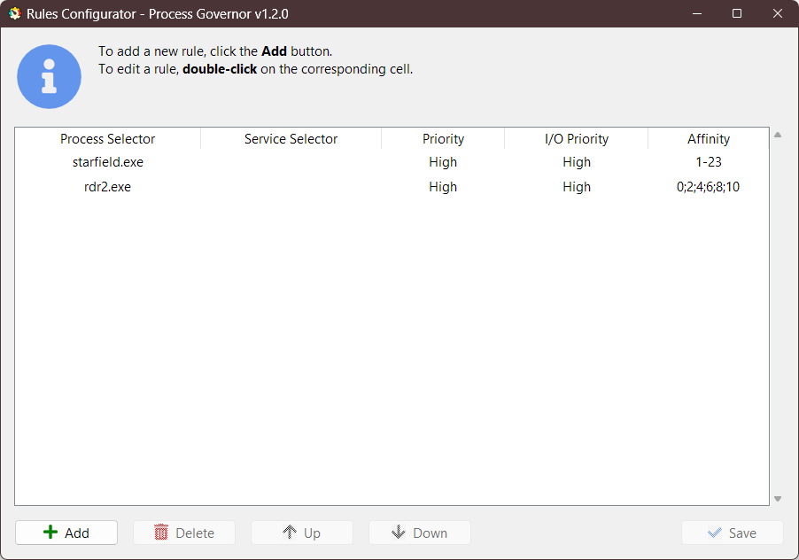

[ README](../README.md) | [ Русская версия](game_optimization.ru.md)

# Optimizing Games using Process Governor

---

## Introduction

Enhancing performance and reducing response time for PC games, such as **Starfield** and **Red Dead Redemption 2**, is
achieved through system resource management. **Process Governor** is a tool that gives users control over processes and
resource distribution, which can significantly improve the gaming experience. In this guide, we will thoroughly examine
the process of configuring **Process Governor** to optimize these popular games.

## Preliminary Setup

Before starting the setup, familiarize yourself with the installation and initial configuration instructions for
**Process Governor**, available in the sections:

- [Getting Started](../README.md#getting-started)
- [Configuring Rules](../ui_rule_configurator.md)

To ensure **Process Governor** automatically starts with Windows, follow these steps:

1. Launch the **Process Governor**.
2. Click on the application icon <u>in the system tray</u> to open the menu.
3. Enable the **Run on Startup** option.

Example of the enabled **Run on Startup** option:


## Creating Rules for Games

Let's look at setting up optimization for two popular games:

1. **Starfield:** To reduce freezes and lags, an optimal strategy would be to exclude the 0th CPU core from processing
   the game, thereby reducing competition with Windows system processes for resources.

2. **Red Dead Redemption 2:** To reduce the number of freezes, it is recommended to disable the use of <u>
   Hyper-threading</u> and limit the game process to working only on physical processor cores (even "core" numbers). It
   may also be helpful to limit CPU usage, for example, using the first <u>6 cores</u>.

Let's proceed to set up the rules.

### Opening the Rule Configurator

1. Launch **Process Governor** if it is not already running.
2. Click on the application icon <u>in the system tray</u> to open the menu.
3. Select the **Configure Rules** option to open the rule configurator.

### Adding a Rule for Starfield

1. In the rule configurator interface, press the **Add** button to add a new rule.
2. Enter the corresponding values in the columns:
    - **Process Selector:** `starfield.exe`.
    - **Priority:** `High`.
    - **I/O Priority:** `High`.
    - **Affinity:** `1-N`, meaning use all cores except the first one.
      > Replace `N` with the number of the highest available core/thread on your processor, starting from 0.

### Adding a Rule for RDR2

1. Press the **Add** button.
2. Enter the corresponding values in the columns:
    - **Process Selector:** `rdr2.exe`.
    - **Priority:** `High`.
    - **I/O Priority:** `High`.
    - **Affinity:** `0;2;4;6;8;10`, meaning use <u>6 cores</u> excluding multi-threading (odd cores).

### Saving the Settings

Check the entered data to ensure that the rule settings match your system configuration and the parameters displayed on
the screenshot. For a system with 12 cores and 24 threads, as in my example, the last available "core" is number 23
starting from 0. That's why for the game **Starfield** we set the range of cores as `1-23`, excluding the first core
from use.



Once all the rules are configured, save them by pressing the **Save** button. Then you can close the rule configurator.

### Game Process Monitoring

- After starting the game, carefully monitor its performance as well as the load on the graphics and central processors.
- If you encounter performance issues, return to the Process Governor settings and make the necessary adjustments.
- If the game **RDR2** requires more resources, consider distributing the game across more cores.

## Alternative Setup Method

You can also configure **Process Governor** by manually editing the JSON configuration file, following the
instructions [here](../configuration_file.md).

The correctly configured configuration file should look like this:

```json
{
  "ruleApplyIntervalSeconds": 1,
  "logging": {
    "enable": true,
    "level": "INFO",
    "maxBytes": 1024,
    "backupCount": 1
  },
  "rules": [
    {
      "processSelector": "starfield.exe",
      "priority": "High",
      "ioPriority": "High",
      "affinity": "1-23"
    },
    {
      "processSelector": "rdr2.exe",
      "priority": "High",
      "ioPriority": "High",
      "affinity": "0;2;4;6;8;10"
    }
  ]
}
```