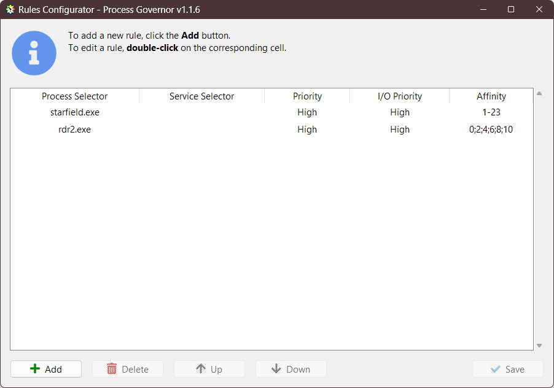

[ README](../README.ru.md) | [ English version](game_optimization.md)

# Оптимизация игр с использованием Process Governor

---

## Введение

Улучшение производительности и сокращение времени отклика игр на ПК, таких как **Starfield** и **Red Dead Redemption
2**, осуществляется через управление ресурсами системы. **Process Governor** — это инструмент, который дает пользователю
контроль над процессами и распределением ресурсов, что может значительно улучшить игровой опыт. В данном руководстве мы
подробно рассмотрим процесс настройки **Process Governor** для оптимизации этих популярных игр.

## Предварительная подготовка

Прежде чем приступить к настройке, ознакомьтесь с инструкциями по установке и начальной настройке **Process Governor**,
доступными в разделах:

- [Начало работы](../README.ru.md#начало-работы)
- [Конфигурирование правил](../ui_rule_configurator.ru.md)

Для обеспечения автоматического запуска **Process Governor** вместе с Windows выполните следующие шаги:

1. Запустите **Process Governor**.
2. Нажмите на иконку приложения <u>в системном трее</u>, чтобы открыть меню.
3. Включите опцию **Run on Startup**.

Пример включенной опции **Run on Startup**:


## Создание правил для игр

Давайте рассмотрим настройку оптимизации для двух популярных игр:

1. **Starfield:** Для сокращения фризов и лагов оптимальной стратегией будет исключение 0-го ядра CPU из обработки
   игры, тем самым уменьшая конкуренцию с системными процессами Windows за ресурсы.

2. **Red Dead Redemption 2:** Чтобы уменьшить количество фризов, рекомендуется отключить использование
   <u>Hyper-threading</u>, ограничив процесс игры работой только на физических ядрах процессора (четные номера "ядер").
   Так же может быть полезно ограничить использование CPU, например, используя первые <u>6 ядер</u>.

Приступим к настройке правил.

### Открытие конфигуратора правила

1. Запустите **Process Governor**, если еще не запущен.
2. Нажмите на иконку приложения <u>в системном трее</u>, чтобы открыть меню.
3. Выберите опцию **Configure Rules** для открытия конфигуратора правил.

### Добавление правила для Starfield

1. В интерфейсе конфигуратора правил нажмите кнопку **Add** для добавления нового правила.
2. В колонках введите соответствующие значения:
    - **Process Selector:** `starfield.exe`.
    - **Priority:** `High`.
    - **I/O Priority:** `High`.
    - **Affinity:** `1-N`, что означает использование всех ядер, кроме первого.
      > Замените `N` на номер максимально доступного ядра/потока на вашем процессоре, начиная с 0.  
      Для системы с 12 ядрами и 24 потоками, как в моем примере, последнее доступное "ядро" имеет номер 23 начиная с 0.  
      Именно поэтому в текущем случае мы задаем диапазон ядер как `1-23`, исключая первое "ядро" из использования.

### Добавление правила для RDR2

1. Нажмите кнопку **Add**.
2. В колонках введите соответствующие значения:
    - **Process Selector:** `rdr2.exe`.
    - **Priority:** `High`.
    - **I/O Priority:** `High`.
    - **Affinity:** `0;2;4;6;8;10`, что означает использование <u>6 ядер</u> исключая многопоточность (нечетные ядра).

### Сохранение настроек

Проверьте введенные данные, чтобы убедиться, что настройки правил совпадают с вашей конфигурацией системы и
отображаемыми на скриншоте параметрами. 



Как только все правила будут настроены, сохраните их, нажав кнопку **Save**. Затем можете закрыть конфигуратор правил.

### Мониторинг игрового процесса

- После запуска игры, внимательно отслеживайте её производительность, а также загрузку графического и центрального
  процессоров.
- При обнаружении проблем с производительностью вернитесь к настройкам в Process Governor и произведите необходимые
  корректировки.
- Если игра **RDR2** требует больше ресурсов, рассмотрите возможность распределения игры на большее
  количество ядер.

## Альтернативный способ настройки

Вы также можете настроить **Process Governor**, редактируя файл конфигурации JSON вручную, следуя
инструкции [здесь](../configuration_file.ru.md).

Правильно настроенный файл конфигурации должен выглядеть так:

```json
{
  "ruleApplyIntervalSeconds": 1,
  "logging": {
    "enable": true,
    "level": "INFO",
    "maxBytes": 1024,
    "backupCount": 1
  },
  "rules": [
    {
      "processSelector": "starfield.exe",
      "priority": "High",
      "ioPriority": "High",
      "affinity": "1-23"
    },
    {
      "processSelector": "rdr2.exe",
      "priority": "High",
      "ioPriority": "High",
      "affinity": "0;2;4;6;8;10"
    }
  ]
}
```