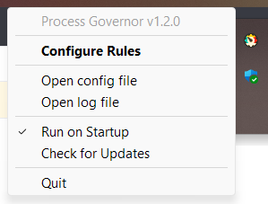

# Configuring Rules

[ README](README.md) | [ Русская версия](ui_rule_configurator.ru.md)

---

## Opening the Rule Configurator

1. Launch the **Process Governor**.
2. Click on the application icon <u>in the system tray</u> to open the menu.
3. Select the **Configure Rules** option to open the rule configurator.

## Interface of the Rule Configurator

The rule configurator interface is a table with several columns:

- **Process Selector**: Specifies the process name or pattern to match.  
  You can use wildcards, including `*` and `?`, to match multiple processes.
    - Example: `example.exe`
    - Example with wildcards: `logioptionsplus_*.exe`

- **Service Selector**: Specifies the service name or pattern to match.  
  You can use wildcards, including `*` and `?`, to match multiple services.
    - Example: `MyService`
    - Example with wildcards: `Audio*`

- **Priority**: Sets the priority for processes or services.
- **I/O Priority**: Sets the I/O priority for processes or services.
- **Affinity**: Specifies CPU core affinity.  
  You can define affinity as:
    - Range (inclusive): `1-4`
    - Specific cores: `0;2;4`
    - Combination: `1;3-5`

> **Note:**
>
> Do not fill in both the **Process Selector** and **Service Selector** fields for a single rule simultaneously.
> If you set both selectors at the same time, it could lead to conflicts or unpredictable rule behavior.
>
> To prevent such situations, validation has been implemented in the program, which will notify you of the need to
> correct the rule.

## Working with Rules

### Adding a New Rule

1. Press the **Add** button.
2. Edit the rule in accordance with the steps described in [Editing a Rule](#editing-a-rule).

### Editing a Rule

1. Double-click on the cell of the rule you want to edit.
2. Enter new data into the selected cell.
3. After editing the cell, the changes will be automatically saved in the table.

### Deleting a Rule

1. Select the rule(s) you want to delete by clicking on the corresponding line.
2. Press the **Delete** button.

### Changing the Order of Rules

1. Select the rule whose order you want to change.
2. Use the **Up** and **Down** buttons to move the rule up or down the list.

### Saving Changes

1. After you have added, edited, or deleted rules, press the **Save** button at the bottom of the window to apply the
   changes.
2. A confirmation message will appear upon successful save.

### Closing the Rule Configurator

1. To close the rule configurator, close the window in the usual way.
2. If there are unsaved changes in the table, the program will offer to save them before closing.

### Tooltips

- In the rule configurator interface, tooltips are present at the top, describing the functions of buttons and fields.
- Hover over an interface element to view the tooltip.

### Error Handling

- If the entered data is incorrect, the corresponding cell will be highlighted, and an error icon will appear next to
  it.
- Hovering over the error icon will display a tooltip with the reason for the error.
- If there are errors, the **Save** button and the option to save upon closing are not available.

