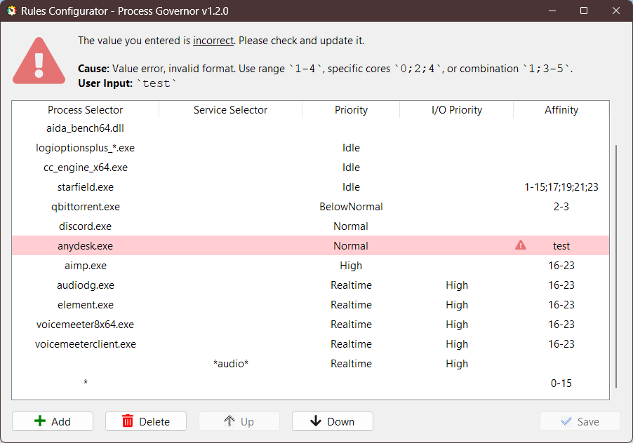

# Конфигурирование правил

[ README](README.ru.md) | [ English version](ui_rule_configurator.md)

---

## Открытие конфигуратора правил

1. Запустите **Process Governor**.
2. Нажмите на иконку приложения <u>в системном трее</u>, чтобы открыть меню.
3. Выберите опцию **Configure Rules** для открытия конфигуратора правил.

## Интерфейс конфигуратора правил

Пользовательский интерфейс конфигуратора правил представляет собой таблицу с несколькими столбцами:

- **Process Selector**: Указывает имя процесса или шаблон для сопоставления.  
  Вы можете использовать подстановочные символы, включая `*` и `?`, чтобы сопоставить несколько процессов.
    - Пример: `example.exe`
    - Пример с подстановочными символами: `logioptionsplus_*.exe`

- **Service Selector**: Указывает имя службы или шаблон для сопоставления.  
  Вы можете использовать подстановочные символы, включая `*` и `?`, чтобы сопоставить несколько служб.
    - Пример: `MyService`
    - Пример с подстановочными символами: `Audio*`

- **Priority**: Устанавливает приоритет процессов или служб.
- **I/O Priority**: Устанавливает приоритет ввода/вывода для процессов или служб.
- **Affinity**: Определяет привязку процесса к ядру CPU.  
  Вы можете указать привязку следующим образом:
    - Диапазон (включительно): `1-4`
    - Конкретные ядра: `0;2;4`
    - Комбинация: `1;3-5`

> **Примечание:**
>
> Не заполняйте одновременно поля **Process Selector** и **Service Selector** для одного правила.
> Если вы установите оба селектора одновременно, это может привести к конфликту или непредсказуемому поведению правила.
>
> Для предотвращения такой ситуации в программе реализована валидация, которая уведомит вас о необходимости исправить
> правило.

## Работа с правилами

### Добавление нового правила

1. Нажмите кнопку **Add**.
2. Отредактируйте правило в соответствии с шагами, описанными в [Редактирование правила](#редактирование-правила)

### Редактирование правила

1. Дважды щелкните по ячейке правила, которое вы хотите отредактировать.
2. Введите новые данные в выбранную ячейку.
3. После редактирования ячейки, изменения будут автоматически сохранены в таблице.

### Удаление правила

1. Выберите правило(ила), которое хотите удалить, щелкнув по соответствующей строке.
2. Нажмите кнопку **Delete**.

### Изменение порядка правил

1. Выберите правило, порядок которого хотите изменить.
2. Используйте кнопки **Up** и **Down** для перемещения правила вверх или вниз по списку.

### Сохранение изменений

1. После того как вы добавили, отредактировали или удалили правила, нажмите кнопку **Save** в нижней части окна, чтобы
   применить изменения.
2. В случае успешного сохранения появится сообщение с подтверждением.

### Закрытие конфигуратора правил

1. Для закрытия конфигуратора правил закройте окно стандартным способом.
2. Если в таблице остались несохраненные изменения, программа предложит сохранить их перед закрытием.

### Всплывающие подсказки

- В интерфейсе конфигуратора правил в верхней части присутствуют подсказки, которые описывают функции кнопок и полей.
- Для просмотра подсказки наведите курсор на элемент интерфейса.

### Обработка ошибок

- Если введенные данные некорректны, соответствующая ячейка будет выделена, и рядом появится иконка ошибки.
- При наведении на иконку ошибки будет показана подсказка с причиной ошибки.
- При наличии ошибок кнопка **Save** и возможность сохранить при закрытии недоступны.

